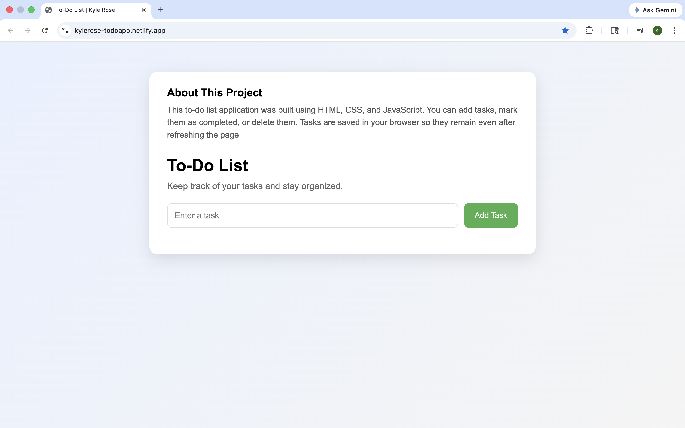
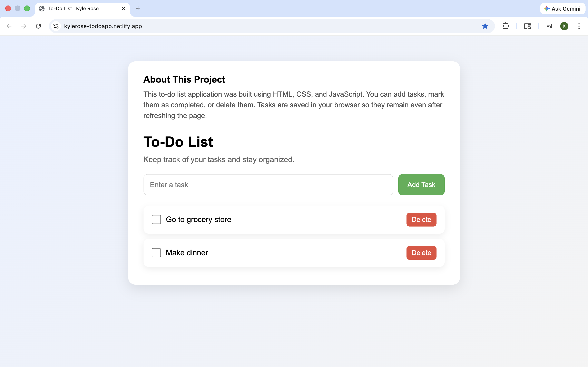

# 📝 To‑Do List App by Kyle Rose

Live Demo: 👉 [https://kylerose-todoapp.netlify.app/](https://kylerose-todoapp.netlify.app/)

---

## 🚀 About

This is a **responsive To‑Do List application** built with **HTML**, **CSS**, and **JavaScript**.  

It allows users to:

- 🟢 Add new tasks  
- ☑ Mark tasks as completed  
- 🗑 Delete tasks  
- 💾 Persist tasks in the browser using `localStorage`, so tasks remain after refreshing the page  

The app features a modern card-style design with a unified about section, responsive layout, and smooth hover effects.

---

## 📌 Features

- Add, complete, and delete tasks  
- Tasks persist across page reloads using `localStorage`  
- Unified card layout with about section at the top  
- Responsive design for desktop and mobile  
- Clean and modern UI with hover animations  

---

## 🧠 How It Works

- Captures user input via the task input field  
- Stores tasks as objects in an array with `completed` status  
- Dynamically renders tasks in the task list  
- Saves and retrieves tasks from `localStorage`  
- Updates task state when checkbox is toggled or task is deleted  

---

## 📁 Project Structure
/
├── index.html
├── style.css
├── script.js
├── README.md
└── .gitignore

---
🖥 Preview
Example:

---

## 🛠 Technologies Used

- **HTML5**  
- **CSS3**  
- **JavaScript (ES6+)**  
