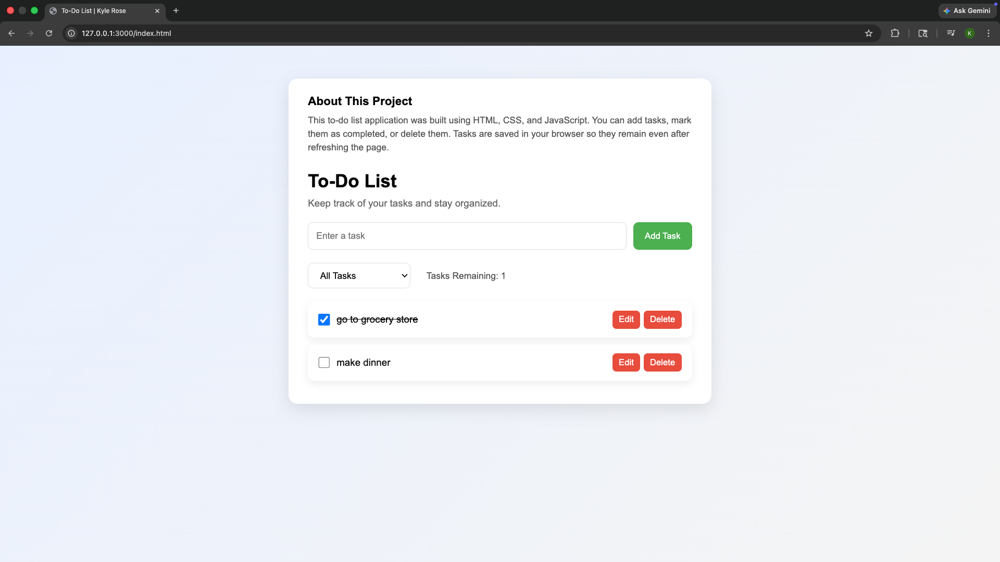

# 📝 To-Do List App by Kyle Rose

**Live Demo:** 👉 https://kylerose-todoapp.netlify.app/

---

# 🚀 About

This project is a **responsive To-Do List web application** built using **HTML, CSS, and JavaScript**.
It allows users to create and manage tasks while keeping them saved locally in the browser.

The app features a **modern card-style interface**, responsive layout, and persistent task storage using **localStorage** so tasks remain even after refreshing the page.

---

# 📌 Features

* ➕ Add new tasks
* ✏ Edit existing tasks
* ☑ Mark tasks as completed
* 🗑 Delete tasks
* 🔍 Filter tasks by:

  * All tasks
  * Active tasks
  * Completed tasks
* 📊 Display **remaining task count**
* 💾 Tasks persist across page reloads using **localStorage**
* 📱 Responsive design for desktop and mobile
* 🎨 Clean UI with hover animations and modern styling

---

# 🧠 How It Works

The application uses **JavaScript DOM manipulation** to dynamically manage tasks.

1. User enters a task in the input field.
2. A task object is created containing:

   * `id`
   * `text`
   * `completed` status
3. Tasks are stored in an array and saved to **localStorage**.
4. The UI is re-rendered whenever tasks are:

   * added
   * edited
   * completed
   * deleted
5. The dropdown filter updates the displayed tasks based on their completion status.

---

# 📁 Project Structure

```
/
├── index.html
├── style.css
├── script.js
├── README.md
└── Images/
    └── example.png
```

---

# 🖥 Preview

Example:



---

# 🛠 Technologies Used

* **HTML5** – page structure
* **CSS3** – layout, styling, and responsive design
* **JavaScript (ES6+)** – task logic, DOM manipulation, and localStorage

---

# 💡 Future Improvements

Potential enhancements for future versions:

* Clear completed tasks button
* Drag-and-drop task ordering
* Due dates for tasks
* Dark mode
* Keyboard accessibility improvements

---

# 👨‍💻 Author

**Kyle Rose**

GitHub: https://github.com/yourusername
